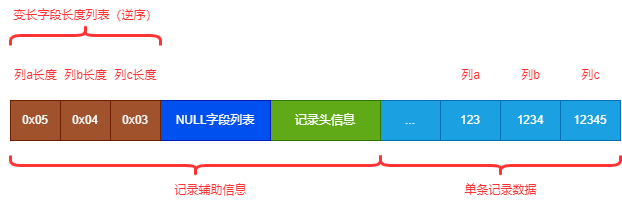
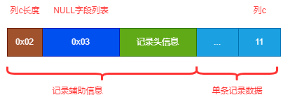
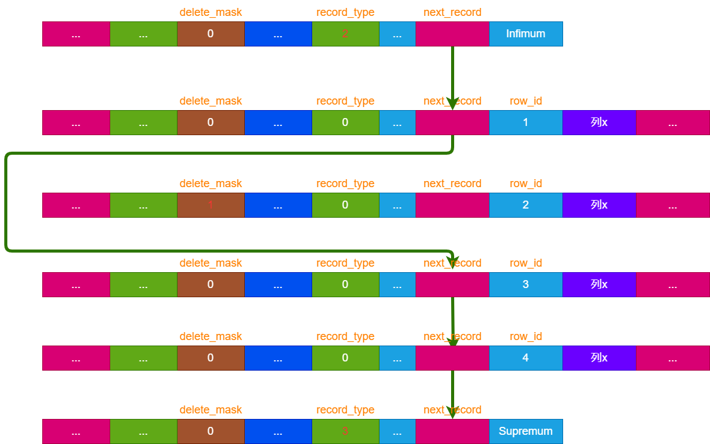
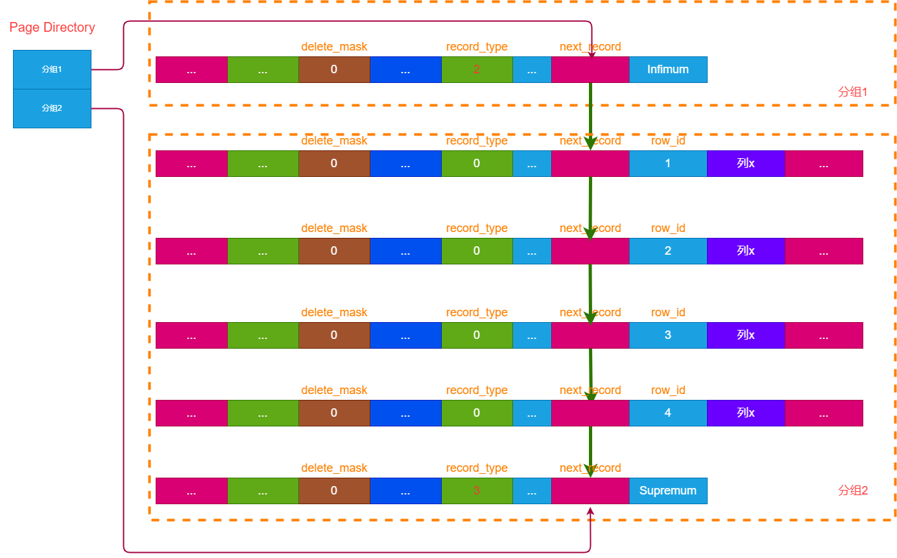
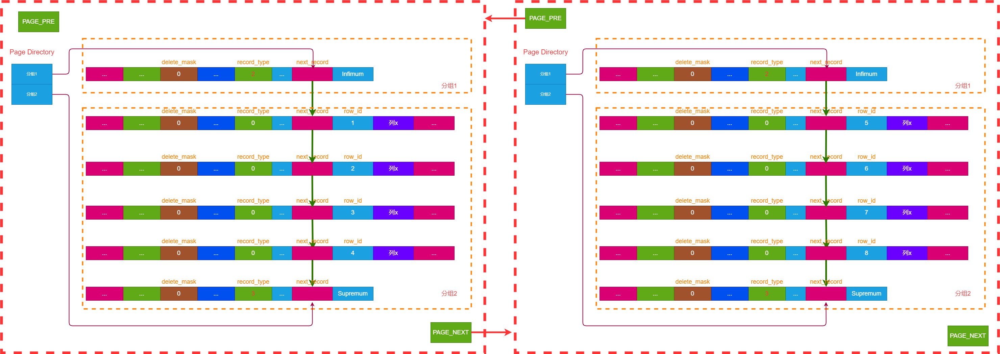

# MySQL 行与页
很多时候，我们对 MySQL 的印象就是一颗 B+ 树（当然，说的是 InnoDB 引擎），却没有真实的去探究这个 B+ 树到底是怎么形成的。自然对于索引，也只能停留在表面的想象，无法理解其原理。

事实上，MySQL 存储的数据无非就是一张张数据表的集合，而数据表又是许多条记录行的集合。而数据记录行到底在 MySQL 里面是怎么存储的呢，记录是按照什么规律存放到磁盘里的？

当然，不同的存储引擎的数据存放也是不同的，这里我们只研究 InnoDB 引擎。

## MySQL 行格式
所谓行格式，顾名思义，即一条记录行所呈现的格式。InnoDB 提供了四种行格式：Compact,Redundant,Dynamic,Compressed. 不过四种格式都大同小异，这里我们以 Compact 为例简单说明就好。

### Compact 行格式
MySQL 5.0 后默认的行格式即为 Compact(不过 5.7 后又变成了 Dynamic)。Compact 意为紧凑的，即试图尽可能节省空间存放更多的数据。

Compact 行格式如下所示：

(图1-1，Compact 行格式示意图)

让我们从左至右分析下：

#### 变长字段列表
我们知道，MySQL允许一些字段为变长字段，例如 VARCHAR 类型。对于这些变长字段，只有在真正插入记录时才知道其字段占了多少字节空间，Compact行格式 会记录这些变长字段的真实空间到行格式的最前端。

例如某表仅存在 VARCHAR 类型的字段 a，字段 b，字段 c. 当插入一条新记录时候 （a='123', b='1234', c='12345'），这三个字段的字节数分别为 3,4,5。然后 InnoDB 会把这三个字段的字节数逆序（注意是逆序）存放。那么此时这条记录的行格式为：

(图1-2，Compact 行格式中 varchar 类型示意图)

#### NULL字段列表
MySQL 允许某些列为 NULL 值，而对于值为 NULL 的列，实际上其字段没有任何内容的，对于这种列，就没有必要为其占据真实的空间。因此，Compact 行格式里面针对这些值为 NULL 的列单独放在NULL字段列表里面。
MySQL 对于每个允许为NULL的列，将其映射为一个二进制位。因此，一个字节就可以映射出8个允许为NULL的列（如果某个表NULL的列超过8个，就用两个字节或者更多）。当该列值为 NULL 时，对应的二进制位 为 1，否则为 0.
同样用上面的表（假设这个表只有a b c 三个列允许为 NULL，那么用一个字节来表示 NULL 字段列表即可），假设插入一行数据 a,b,c的值分别为(NULL, NULL, '11')，其中列 a 和列 b 为 NULL，此时 NULL 字段列表应该为 11000000, 同样的，MySQL 会将其逆序存放，即变为 00000011(转为16进制即 0x03)
那么此列的行格式如图：

(图1-3，Compact 行格式中 NULL 类型示意图)

#### 记录头信息
记录头信息是一些辅助信息，记录该行的一些关键信息。固定为40个字节。这里不回去详细说每个字段有么用，占用多少字节（记这个是没意义的），只摘出几个很关键的字段说明其作用：

(图1-4，Compact 行格式中记录头信息示意图)

- delete_mask: 删除标志位，很重要。若此标志位为1，代表这条记录已经被删除了。
- min_mask: B+树非叶子节点中，索引记录的中最小记录。后面讲到索引的时候再说。
- n_owned: 分组里面包含的记录总数，分组后面再说。
- heap_no: 后面再说。
- record_type: 很重要，记录的类型（0-普通用户记录，1-索引记录，2-Infimum, 3-Supremum）
- next_record: 指针，指向下一条记录，很重要。

#### 记录真实数据
记录真实数据没什么好讲的，就是存放我们自定义的列。不过，需要注意一点，MySQL 会为默认增加3个列：
- row_id: 主键ID，若用户自定义了主键则不生成，使用用户主键作为 row_id. 否则MySQL 会默认生成一个 row_id 的主键列
- trx_id: 事务ID，表明最近一次修改当前记录的事务ID(若为新插入的记录，则为插入记录的事务ID)
- roll_ptr: 回滚指针，指向记录的历史版本，主要用于 MVCC，后面会讲到

## MySQL 数据页
前面讲了数据行格式，接下来就是看 MySQL 是如何把这些行真实记录到磁盘的。
我们知道，从磁盘读数据是比较慢的（相对于内存操作来说，磁盘IO的性能大多了）。因此，为了提高交互效率，MySQL 不可能每次跟磁盘一行行记录的交互。事实上，MySQL 与磁盘的交互单位叫做页，页一般大小为 16KB。也就是说，每次MySQL 读取磁盘的时候，都会读取 16KB 的数据。

MySQL 的数据页格式示意图如下：

(图1-5，数据页示意图)

### Infimum 和 Supremum
MySQL 在每个数据页会生成两条特殊的记录（Infimum 和 Supremum），分别代表最小记录和最大记录，记得上面行格式的记录头信息里面的record_type字段吗，其中 Infimum 记录的 record_type=2, Supremum 记录的 record_type=3.

### User Records
这个部分代表用户记录，即我们真实插入的数据行，实际上他就是由大量的行格式拼接组成的。注意，这些记录行在 User Records 里本身的存放是没有任何顺序的，其利用的是链表来实现有序性。

MySQL 通过 row_id(即主键值) 对数据页内的所有记录组成一条升序的链表（注意，主键一定是唯一的）。Infimum 代表最小记录，所以他是链表头节点，Supremum 是数据页最大的记录，所以是链表的尾节点。而这个链表实际上就是通过行格式记录头信息里面的 next_record 指针实现的。

我们仅保留行格式的一些主要信息作示意:

(图1-6，一条row_id=1的用户记录简单行格式示意图)

假设某个数据页里面此时插入了4条记录，主键 row_id 分别为 1,2,3,4, 然后删除了 row_id=2 的记录，此时的数据结构示意图如下：

(图1-7，用户记录逻辑结构示意图)

上图需要注意几个点：
- Infimum 是链表头结点，Supremum 是链表尾节点
- 除 Infimum 和 Supremum 外，其他记录的 record_type 都为0，代表普通用户记录
- 链表通过主键id (row_id) 升序排列，前一条记录的 next_record 指针指向下一条记录的 next_record.
- row_id=2的记录被删除后，其delete_mask被置为1，因此链表会跳过这条记录，直接执行下一条记录  

还记得之前的行格式里面，像变长字段列表，NULL字段列表，之前都是按照列的逆序存放的吗。这是因为我们找下一条记录的时候，找到的是 next_record 的位置，从这个位置，往右边依次读取各列，然后往左边可以读取NULL列表，变长列表，由于这两个逆序存放，这不就巧了吗。

### Page Directory
Page Directory 即为页目录，它的作用是为了加快在一个数据页中的查找速率。
前面说过页里面存在一条有序链表，我们都知道有序序列里面，查找用二分法是很快速有效的方法。但问题就在于这里是一个链表，而不是数组。

对于有序数组来说，我们可以以 O(1) 的效率取到中间元素，因为数组支持随机读取。

然后有序链表不行，因为链表不支持随机读取，只能从头结点开始遍历才能找到中间节点。除非能提前知道每个链表节点的位置，才能进行随机访问。

既然这样，搞一个数组依次记录链表每个节点的位置不就好了？通过数组的第n的元素，其就对应链表中第n条记录的指针，然后拿这个指针就可以找到对应的记录了。这个数组就叫做目录，通过目录中的元素，可以O(1)的时间复杂度找到每个链表节点的位置进行访问，目录中的每一项称之目录项。想想你买的书前面是不是都有一个目录？

实际上，页目录差不多就是这么做的，只不过页目录没有对每一条记录都生成目录项，他是把记录分为多个组，然后为每一个组生成一个目录项。

实际过程如下：
MySQL 把页里面的有序链表记录依次分为多个组，用组内最后一条记录（也是最内最大的记录）的指针，作为目录项记录在 Page Directory 中，有多少个组，Page Directory 里就有多少个目录项。

用一个示意图如下：

(图1-8，用户页目录分组示意图)

上图有几个注意点：
- Page Directory中每一项指向的是当前分组的最后一条记录
- 每个分组最后一条记录里面的记录头信息里的 n_owned 字段会记录当前分组有多少条记录，图中未画出

假设此时查找 row_id=x 的记录， 那么实际查找过程如下:
1. 从页目录中取主键元素，通过指针找到对应记录得到其主键值，若大于主键值，说明要查找的记录在左边，往左走；否则往右走。直到查到最终记录所在的分组。
2. 找到记录所存在的分组后，我们只能得到此分组最大的记录的位置。此时目标记录在这个分组内，我们需要遍历这个分组，但我们只能从分组的最小记录遍历到最大记录，没法反向遍历（因为是单向链表）。此时需要一个方法获取到该分组的第一条记录位置。怎么获取呢？实际上，我们取此分组的前一个分组，前一个分组的最大记录的下一条记录，不就是此分组的最小记录了吗，然后就可以遍历分组直到找到目标记录。

注意这个过程：
- 第一步在查找分组的时候是用的二分法，复杂度 O（logN）
- 第二步在遍历单个分组时复杂度 O(N)

因此，单个分组元素不能太多，否则遍历会比较耗时间。MySQL 规定单条分组为 4-8 条之间，因此遍历一个分组的成本是较低的。

### Page Header
Page Header 是文件头，我们只关注里面最重要的信息：里面有两个指针 PAGE_NEXT 和 PAGE_PRE，分别指向后一个数据页和前一个数据页。由此将多个数据页组成双向链表。

## 数据页的排列
上面讲到一个数据页内，所有的记录按照主键升序排列为单向链表。一个数据页仅仅为16KB，若表中有大量的记录，显然一个数据页是不够存的，需要多个数据页存放这些记录，那这些数据页是如何排列的呢？

同样是按照主键值的顺序，MySQL 将不同的数据页组成双向链表。

当然这是有必要的，为了保证查找的效率。

(图1-9，多个页示意图)

以上图需要注意的点：
- 每个页有PAGE_PRE和PAGE_NEXT两个指针，PAGE_PRE 执行前一个数据页，PAGE_NEXT 后一个数据页，由此将不同页构成双向链表。
- 后一个页的记录主键值，一定比前一个记录的主键值大。整体按照升序排列。

假设一个页只能放 3 条记录，我们先插入了 3 条记录（row_id=1,2,5）。这3条记录组成一个数据页没问题。之后又插入一条 row_id=3 的记录，这时候怎么办呢？
为了保证后一个数据页记录始终大于前一个，此时会执行页分裂操作，简单来说，就是通过一些记录的移动等，比如这里将 row_id=5 的记录移动到新的数据页里面，然后再到原来数据页插入 row_id=3 的记录，这样就保证了数据页间的有序性。

可以看到，MySQL 为了保持有序性，做了这么多额外的操作，究竟这些有什么作用呢，在后面讲到索引的时候就很清楚了！

# 参考资料
《MySQL是怎样运行的 从根儿上理解MySQL》作者：小孩子4919
《MySQL技术内幕:InnoDB存储引擎》作者：姜承尧

