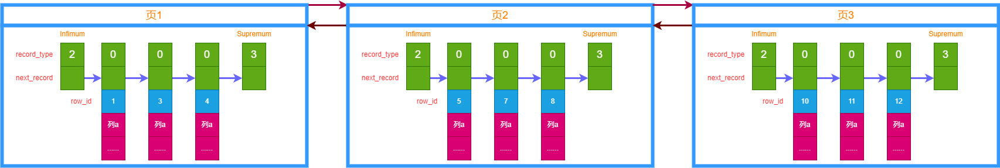
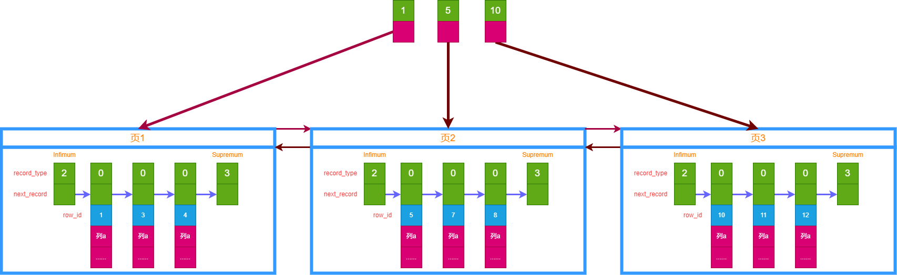

# MySQL 索引结构
上一章讲 MySQL 的行格式以及数据页。单个数据页里面记录按照主键升序组成链表，多个数据页按照主键组成双向链表。

MySQL 究竟为什么要做这么多额外操作？

自然是为了数据的高效查询了，而数据高效查询的秘密，就在于索引。

## 聚簇索引
还是以主键查询为例，我们前面讲过，在单个数据页里面，由于存在 Page Directory 页目录，可以使用二分法提高主键查询的效率。然而当记录分散在多个数据页里面呢？如何定位到目标记录位于哪个数据页上？

如果没有索引，那么只有从第一个数据页开始，遍历所有数据页，直到找到目标记录的数据页，然后再去该数据页内用二分法查找。对于数据页较多的表来说，这个查找效率显然很低下。

回想之前的 Page Directory，我们是不是可以为数据页也搞一个目录？有了数据页的目录，这样就可以通过二分法快速定为数据所在的页了。

我们把单个数据页的内容简化一下如图：

(图2-1，数据页简单示意图)

- 各个页组成双向链表，后一个页主键一定比前一个页大。

这里只画了页的示意图，实际上一张表可能有好多好多页，一个页里面有好多好多条记录。

OK，现在我们为这些页加目录，我们把每一个页的最小记录的 row_id，以及该页的地址 page_address 记下来称为一个目录项，由此可以得到3个目录项。

(图2-2，简单目录项示意图)

如上图，这个目录项看上去已经像那么回事了。假设我们要找一条 row_id = 7 的记录过程如下：
1. 查看第一个目录项，其值为 1，比 7 小，说明目标数据页可能在此目录项或者下项目里面。
2. 查看第二个目录项，其值为 5，比 7 小，说明还在右边。
3. 查找第三个目录项，值为10比7大，说明此页所有的记录值 row_id 都大于 7，也就是说目标记录在前一个数据页里面。
4. 转到前一个目录项对应的数据页，然后按照前面说的二分法查找记录就好了。

