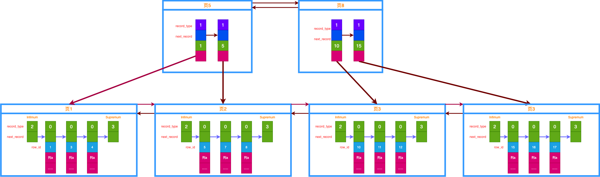
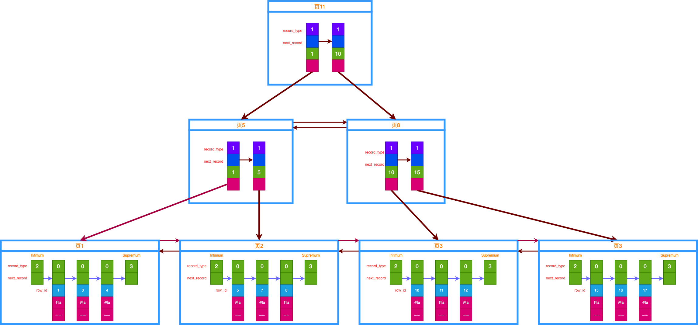
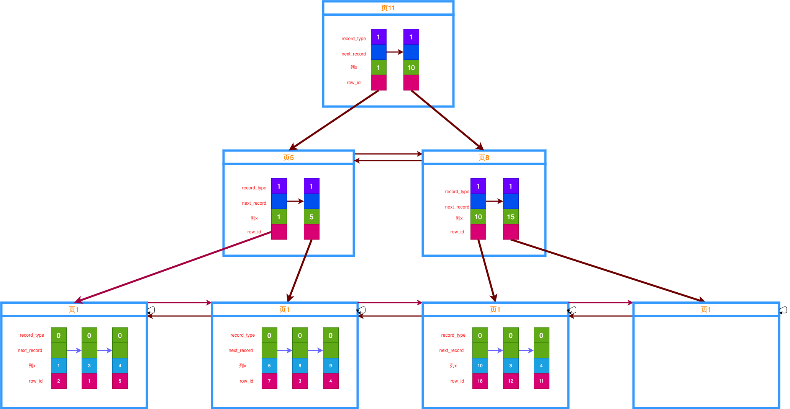

# MySQL 索引结构
上一章讲 MySQL 的行格式以及数据页。单个数据页里面记录按照主键升序组成链表，多个数据页按照主键组成双向链表。

MySQL 究竟为什么要做这么多额外操作？

自然是为了数据的高效查询了，而数据高效查询的秘密，就在于索引。

## 聚簇索引
还是以主键查询为例，我们前面讲过，在单个数据页里面，由于存在 Page Directory 页目录，可以使用二分法提高主键查询的效率。然而当记录分散在多个数据页里面呢？如何定位到目标记录位于哪个数据页上？

如果没有索引，那么只有从第一个数据页开始，遍历所有数据页，直到找到目标记录的数据页，然后再去该数据页内用二分法查找。对于数据页较多的表来说，这个查找效率显然很低下。

回想之前的 Page Directory，我们是不是可以为数据页也搞一个目录？有了数据页的目录，这样就可以通过二分法快速定为数据所在的页了。

我们把单个数据页的内容简化一下如图：


(图2-1，数据页简单示意图)

- 各个页组成双向链表，后一个页主键一定比前一个页大。

这里只画了页的示意图，实际上一张表可能有好多好多页，一个页里面有好多好多条记录。

OK，现在我们为这些页加目录，我们把每一个页的最小记录的 row_id，以及该页的地址 page_address 记下来称为一个目录项，由此可以得到3个目录项。


(图2-2，简单目录项示意图)

如上图，这个目录看上去已经像那么回事了。假设我们要找一条 row_id = 7 的记录过程如下：
1. 查看第一个目录项，其值为 1，比 7 小，说明目标数据页可能在此目录项或者下项目里面。
2. 查看第二个目录项，其值为 5，比 7 小，说明还在右边。
3. 查找第三个目录项，值为10比7大，说明此页所有的记录值 row_id 都大于 7，也就是说目标记录在前一个数据页里面。
4. 转到前一个目录项对应的数据页，然后按照前面说的二分法查找记录就好了。

注意这里，每一个数据页，就对应生成一个目录项，那么当数据很多，占据了很多的数据页的时候，对应的目录项也会很多。这么多的目录项，MySQL 总要想个办法给他存起来。再看看上图，实际上每个目录项的排列也有有序的（按 row_id 升序排列），他们也能组成有序链表，有没有发现，这个目录项其实就跟用户记录类似。

因此，MySQL 同样采用类似于存储用户记录的方式来存放这些目录项，把他们也放在页中，这个页被称为索引页。它存放的记录为索引记录。

还记得前面行格式里面记录头信息的 record_type 字段吗，当他等于1的时候即代表此记录为索引记录。我们假设一个数据页只能放两条索引记录（实际一个数据页可以放好多好多条，这里只是画图方便）。
因此，索引记录存放如下所示：


(图2-3，索引项在数据页中示意图)

图中只有两个索引项数据页，查找还很快。
举个例子，现在要找 row_id=12 的记录：
1. 由于不知道该找哪个索引页，所以只有依次在每个索引页里面找，首先是页5，通过二分法快速查找后发现不存在。
2. 继而去下一个索引页8，通过二分法找到row_id=10索引项，由于其下一索引 row_id=15, 说明目标记录在当前索引对应数据页里，然后
3. 通过索引项找到数据页3，然后二分法在数据页中找到记录。

假设索引页也很多怎么办？那我们还需要依次去遍历每一个索引页，才能找到目标索引记录所在的索引页，有没有办法能快速定位目标索引项位于哪个数据页？

等下，是不是觉得很熟悉？这不就跟我们前面如何去定位目标记录位于哪个数据页一样的吗？解决办法就是，为每个索引页再生成一个索引目录项，即往上拓一层结构，这个过程是递归的，直到当前层只需要一个页就能存放所有索引项的时候。到此为止，只有一个页，那就自然不用再定位位于哪个页了。

那么最后的数据结构示意图如下：


(图2-4，B+树索引示意图)

如图即为索引的真实数据结构了，这个形状看起来像是一棵树，事实上它被称为 B+ 树。最上一层只有一个结点，称为根结点。最下一层结点都没有子节点，索引他们被称为成为叶子结点。
通过这个B+树，我们可以得到以下信息：

- 所有叶子节点组成一个双向链表，节点之间按照 row_id 升序排列。叶子节点均为数据页，存放的是用户记录。因此，所有的用户记录都存放在叶子节点上。
- 所有的非叶子节点都是索引页，存放的记录为索引记录。

这整个 B+ 树就叫做索引，此外，由于它是根据主键排序的，并且存放了所有的用户记录，这个索引又被称为聚簇索引(或者叫主键索引)。
InnoDB 的每一张表都会有这样一个聚簇索引存在，它是自动创建的。有了聚簇索引，我们能很方便的根据主键来查找数据。

观察这个 B+ 树，我们发现当需要访问一条记录时，至少需要读取 n 个页，n 代表 B+ 树的层数。就按上面查找 row_id=12 来说，先要访问页11，然后是页8，然后是页3。每读取一个页，MySQL 就需要与磁盘做一次 IO 操作，而前面说过 IO 操作是比较耗时的，因此，我们的 B+ 树层级不宜过高，一般 3-4 层差不多了。

3层树，能存放多少条记录呢？
假设一个页16KB能存放100条用户记录，能存放1000条索引记录。
若为1层：1层全是叶子节点，放的用户记录，那么最多100条记录
若为2层：100 * 1000
若为3层：100 * 1000 * 1000
若为4层：100 * 1000 * 1000 * 1000
可见，4层能存放的记录已经很多很多了，一般单个表也不会有这么多记录(有的话就要考虑拆分了，否则性能会变低)。

## 二级索引
聚簇索引是默认生成的，但他按照主键排序的，只对主键的查询才能提效。有时候我们需要根据非主键的列来查找数据，这时候就没法用到聚簇索引的快速查找了。

不要慌，InnoDB 是支持我们对某个列自建索引的。自建索引又被称为二级索引，与主键索引不同的是，他的叶子节点放的不是用户真实数据，只放了记录的主键row_id，我们需要根据 row_id 的值再去查一遍聚簇索引才能得到用户记录，这个过程叫做回表。

所谓对某个列项x建索引，就是生成一个按照列 x 排序的B+树索引。



(图2-4，二级B+树索引示意图)

上图对列x建立的索引可以得到以下几个信息：
- 整个B+树按照列x升序，每个索引项是每个列x的值，还会包含主键id。包含主键id 是因为二级索引可能是非唯一的，同一个值存在多条记录，因此在二级索引一致的情况下，再按主键值排序。
- 叶子节点存放的只有主键值

若我们查询语句为：
```
SELECT * FROM table WEERE x=10;
```
此时根据列x的索引最终查找到目标记录的主键 row_id=18,如何再使用 row_id=18去聚簇索引里面查找用户记录，最终把各列的值返回出来。这个去聚簇索引的过程就是回表。

当然，某些情况下我们是不需要回表的，这样可以加快效率：
若我们查询语句为：
```
SELECT row_id FROM table WEERE x=10;
```
由于我们只需要查询主键的值，此时就不需要再去回表了。这种特殊情况我们称之为用到了覆盖索引，所谓覆盖索引，就是索引上的列包含了需要查询的全部值。

## 联合索引
InnoDB 支持联合索引，比如对多个列 a，b，c 同时建立联合索引。联合索引也是一种二级索引，只需要在索引项里存放 a，b，c 三个列的值，按照排序规则（先比较a，a一致比较b，b一致比较c）如此去建立一棵B+树即可。不再详述了。

## 索引的作用
1. 查找效率高
2. 可以帮助结果排序
3. 分组

## 索引的代价
1. 占空间
2. 增加、修改记录的时候同时需要去修改索引记录

