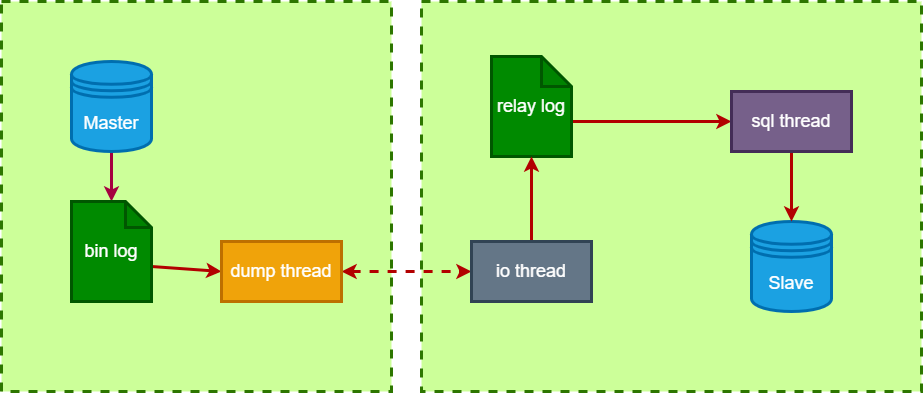
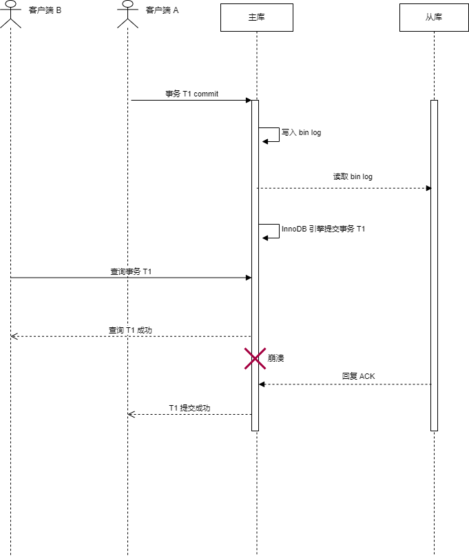
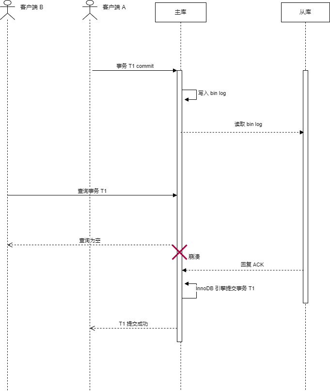

<!--
 * @Author: Gooddbird 1753009868@qq.com
 * @Date: 2023-07-30 18:43:11
 * @LastEditors: Gooddbird 1753009868@qq.com
 * @LastEditTime: 2023-08-19 15:05:52
 * @FilePath: \workspace\treasure\MySQL\5.MySQL容灾.md
 * @Description: 这是默认设置,请设置`customMade`, 打开koroFileHeader查看配置 进行设置: https://github.com/OBKoro1/koro1FileHeader/wiki/%E9%85%8D%E7%BD%AE
-->
# 1.MySQL 复制原理

## 1.1 bin log
MySQL 复制是基于 bin log 的，bin log 是 MySQL 服务层的日志，不是引擎产生的日志，所以不论是 InnoDB 还是其他引擎，都会产生 bin log。而前面讲的事务中的 redo log, undo log 则只有 InnoDB 引擎才会产生。
bin log 是二进制日志，它的本质是记录当前 MySQL 服务端执行的写操作（如 Update，Insert 等，不包含 Select）。
而复制的原理，就是将 bin log 从一个MySQL实例发送给另外一个实例，通过重放 bin log，达到数据复制的目的。

bin log 有三种记录格式：State,Ment、Row、Mixed。

- StateMent: 记录每一条修改的SQL语句，日志体积小，但若SQL语句中有 now 等函数，会有数据不一致问题
- Row: 默认方式，记录数据的修改细节，数据保持一致，但日志体积大
- Mixed: 混合使用上面两种格式，综合两者特点。


## 1.2 为什么要复制？
复制的前提是多机部署，如果 MySQL 只有一个单机实例，那就没必要复制了。然而事实上，在生产环境是不会仅部署在单机的，假设这台机器宕机了，没有容灾的话整个服务直接不可用了。更严重的，可能出现数据丢失的风险，这个后果是无法估量的。因此，生产环境的 MySQL 实例，肯定是需要多机部署，做备份的。

当然，多机部署还有其他的好处：例如读写分离降低主库压力、数据备份、容灾切换等。


既然有多个 MySQL 实例，那如何保持各个实例之间的数据一致性就成为了关键问题。通过复制，可以将MySQL实例的数据复制到另外一个实例上。

## 1.3 复制的过程
MySQL 的主从复制主要靠传输 bin log 来实现。整个复制过程如图所示：


1. 主库数据变更，写入 bin log
2. 从库连接到主库后，主库启动一个 dump thread, 从库启动一个 io thread。
3. 从库的 io thread 请求读取主库的 bin log，主库的 dump thread 将 bin log 传输给从库
4. 从库的 io thread 读取到 bin log 后，将其写入到 relay log 中
5. 从库的 sql thread 读取 relay log 的日志，然后重放操作，实现主从复制。

整个过程涉及到 2 个 日志（bin log 和 relay log），三个线程 （dump thread, io thread, sql thread）

## 1.4 两阶段提交
在上面的复制过程中，我们可以看出从库是通过主库的 bin log 来复现数据的。然而当我们使用到 InnoDB 引擎时，我们知道，InnoDB 为了实现事务的持久性，会额外记录 redo log. 当数据库崩溃重启后，会根据 redo log 的记录来恢复数据。

那么问题是，如果 bin log 的数据跟 redo log 的数据不一致，那么当主库崩溃重启后，回放 redo log，就跟从库的数据不一致了，这显然是不可接受的。

核心问题是如何保持 bin log 跟 redo log 的一致性。
假设1：提交事务过程中，先写 bin log, 再写 redo log，再提交事务。
若bin log 写入成功，redo log 写入失败，此时从库读取到了此 bin log ，导致从库有主库中不存在的数据。


假设2：提交事务过程中，先写 redo log, 再写 bin log，再提交事务。
若 redo log 写入成功，bin log 写入失败，主库崩溃重启读取 redo log 恢复数据。此时会导致从库的数据丢失这部分事务。

可见，不论是先写入 redo log，还是先写入 bin log 都会有数据不一致的问题。为了解决这个问题，MySQL 采用两阶段提交。

第一阶段：事务写入 redo log，但事务状态设为 Prepare 状态，此状态代表事务还未提交成功

第二阶段：写入 bin log，然后再把 redo log 中的事务状态设置为 Commit，代表事务提交成功

假设写入 bin log 这一步失败，MySQL 崩溃重启后，找到 redo log 里面的事务状态为 Prepare, 然后又去查找 bin log 发现不存在此事务，因此回滚该事务即可，同时从库也不会有这个事务（因为 bin log 没写入成功）,可以保证数据一致。

假设写入 bin log 成功了，但在更新 redo log 为 Commit 的时候失败了，MySQL 崩溃重启后，找到 redo log 中事务状态仍然为 Prepare，然后找到 bin log，发现有数据，于是 MySQL 将此事务提交成功，这样主库从库都会有此事务，数据保持一致。

注意，上面的两阶段提交要保证数据的一致性，还需要一些额外的前提，即确保 redo log 和 bin log 需要即时写入磁盘才行，这个可以通过配置来实现（innodb_flush_log_at_trx_commit 设为 1，sync_binlog 设为 1），这两个选项虽然牺牲了一定的性能，但为了保持数据一致性，还是很有必要的。

## 1.5 基于 GTID 的复制
GTID: 即全局事务ID，可以在 MySQL 集群中唯一的标识一个事务，由 serverUUID 和事务编号组成,即：
```
serverUUID:tid
```
其中 serverUUID 是每个 MySQL 实例启动时生成的，在整个集群中是唯一的，用它可以定位到集群中的某台实例。tid 是事务编号，一般情况下是递增生成。

基于 GTID 的复制过程中，首先主库会给每一个写事务（只读事务不会）分配一个 GITD，并且会记录到 bin log 内。 

从库读取 bin log 到自身的 relay log 后，会解析到待同步的事务集合，并且设置全局变量 gtid_next 为下一个待执行的事务的 GITD。

紧接着，从库的 SQL 线程读取 relay log 找到 gtid_next 这个事务，判断自身 bin log 是否指向过此事务，若执行过则忽略，否则执行事务，然后记录 GTID 到自身 bin log 中。

可见，使用 GTID 复制后，可以防止同一个事务被多次执行，因为同一个 GTID 只会执行一次，后面的都会被忽略。

并且，当从库连接上主库时，通过 GTID 能够自动的快速定位自身开始复制的位置，而不需要像传统的复制一样，需要指定 bin log 文件的位移。


## 1.6 复制的类型
基于复制触发的时机，MySQL 实际上支持同步复制、异步复制、以及半同步复制。

# 2. 异步复制
首先是较为简单的异步复制，这也是 MySQL 的默认复制方式。

异步复制主要体现主库写入 bin log 后，不会等待从库复制完，而是直接就返回客户端响应了。举个具体的例子来说，就是对于某个事务 A，主库已经返回了 A 事务提交成功，但此时可能包含该事务的 bin log 还没有复制到从库上，即从库还没有这个事务。

异步复制的明显优点，就是将复制和主库的响应这两件事解耦开来，主库总是能及时的回复客户端结果，而无需等待复制完成。

因为要确认复制的完成，主库需要等待从库的确认才行，这个等待时长很大程度取决于网络通信的效率，如果主库从库在同一个机房内，那么时间尚可控，但如果主从位于不同的机房，甚至两者已经跨城了，那这个等待的时间将变长很多。

异步复制省略了这个等待时间，自然效率就提升了很多。但问题也随之而来。显然，异步复制存在数据不一致的问题，从库上的数据总是落后于主库，甚至落后了很长时间。并且这个延迟时间是无法保证的，因为整个流程都是异步进行。

一旦主库宕机无法重启后，此时就面临着需要选择某个从库作为新的主库，然后这样会导致严重的数据丢失。你想想，假设你提现了100到银行卡，钱已经到账了。但主从切换后，新的主库不包含这个事务了，相当于你从来没提过钱，这显然是无法接受的。

基于异步复制的特性，通常可以用来做数据热备份，以及查询备机（能忍受时延），但一般不会被选为新的主机，因为数据可能丢失。


# 3. 同步复制
同步复制则是严格的保证数据一致性，从而牺牲性能。所谓同步复制，即主库必须等待所有从库返回 ACK 确认后，才会对客户端返回事务提交成功。注意是所有从库。

基于同步复制的特性，可以保证数据不丢失，因为所有从库都会保持相同的数据，主库宕机后，任意选择一个从库作为新的主库，也不会有问题。

当然，显而易见带来的问题是性能的严重下降。特别是：只要有一台从库异常了，无法成功复制数据，那么整个 MySQL 集群不可用了，需要一直阻塞等待。并且我们没有办法保证所有实例都不出问题，网络超时、机房崩溃等这些都是不可避免的。

因此，同步复制往往不在实际生产应用的考虑范围之内，可用性太差。

# 4. 半同步复制
异步复制保证可用性，但不保证一致性。同步复制保证一致性，但不保证可用性。两者都不是靠谱的解法，因此 MySQL 又引入了一种复制方式：半同步复制。
半同步复制：即主库在对客返回事务提交成功前，需要收到部分从库的 ACK 确认。注意这里只需要部分实例，而不是全部。

这个值是可以由自定义配置的，ACK 越多，那么就有越多的从库拥有完整数据，也就越安全，当然，集群性能也越差。

举个例子：假设集群有 3 个实例，半同步 ACK = 1 即可，因为至少有一个从库拥有完整的数据，即使主库宕机后，也可以切换此从库作为新的主库，数据不会丢失。
那如果 ACK = 2 呢，实际上，这个场景下 ACK = 2 就变为同步复制了，没有必要。

半同步复制还有一个重要的配置：AFTER_COMMIT or AFTER_SYNC，区分这两种方式主要是事务提交的时机不同。

## 4.1 AFTER_COMMIT
AFTER_COMMIT 模式下，假设客户端A发起事务T1。主库执行事务T1，在收到从库的 ACK 之前，主库就已经把引擎中的事务 T1 置为提交状态了，只是还没对客户端 A返回提交成功。因此这个事务 T1 对请求客户端A来说还不是提交成功的状态，但此事务可以被其他客户端 B 可见了。



假设此时从库还没读取到 bin log，突然主库崩溃，发生主从切换后，新的主库并不包含这个事务 T1，客户端 B 连接新主库后，又查询不到事务 T1 了。

对于客户端 B 来说，上一次查询到事务 T1 提交成功，然后后面又查询到事务 T1 不存在，即发生了幻读。在某些场景下，这会造成严重的问题。

比如是，客户端A是一个扣款服务，发起的事务 T1 是扣除账户资金，客户端 B 是库存服务，当他查询到事务 T1 成功后，认为扣款成功，于是扣减库存，向商户发货。然而主从切换后，此事务 T1 丢失了，账户资金并没有被扣除，但是已经发货了，造成严重的损失。

此外，还可能造成事务重复执行的问题。主库崩溃后，原客户端 A 由于收不到提交成功的响应，认为事务未执行成功，于是向新的主库再次提交该事务 T1，新主库执行事务 T1 成功。过一段时间后，原主库重启成功，重启的时候执行一次事务 T1（因为崩溃前事务T1已经在引擎提交成从），然后以从库的身份加入集群，拉去新主库的 bin log 同步数据，新主库中的事务 T1 也会被同步过来，相当于执行了两次事务 T1，以这个场景下，即从库中扣了两次款，这同样是严重的数据不一致问题。

## 4.2 AFTER_SYNC
AFTER_SYNC 模式解决了 AFTER_COMMIT 模式的数据不一致问题，他把引擎提交事务的时机延后到收到 ACK 之后。
如图所示：


在收到从库 ACK 之后，MySQL 才会到引擎层提交事务 T1，因此在这之前，客户端 B 是不会查询到这个事务 T1 的，即使主库崩溃之后，也就不存在之前的幻读问题了。

因此，一般来说，没特殊要求的情况下，最好使用 AFTER_SYNC 模式。