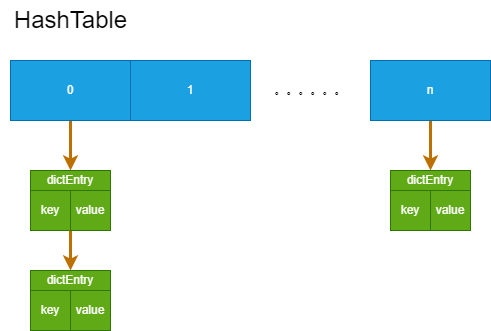
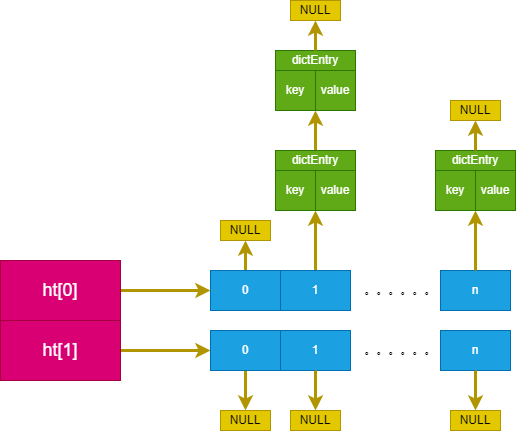

<!--
 * @Author: Gooddbird 1753009868@qq.com
 * @Date: 2023-08-06 13:04:44
 * @LastEditors: Gooddbird 1753009868@qq.com
 * @LastEditTime: 2023-08-12 13:18:28
 * @FilePath: \workspace\treasure\Redis\1.Redis基础数据结构.md
 * @Description: 这是默认设置,请设置`customMade`, 打开koroFileHeader查看配置 进行设置: https://github.com/OBKoro1/koro1FileHeader/wiki/%E9%85%8D%E7%BD%AE
-->
# 1. Redis 基础数据结构

## 1.1 SDS
SDS 即简单动态字符串，字符串就不在多说了，只列举下它的特点：
- SDS 兼容 C 语言的字符串操作函数
- SDS 保存了字符串长度，可以O(1) 获取
- SDS 二进制安全的，可以保存文本或二进制数据

## 1.2 双向链表
Redis 同样支持了链表的数据结构，他是一个无环的双向链表。这里也不再多说。

## 1.3 Dict
Dict 即为字典，而字典的本质就是哈希表（HashTable）, 是 Redis 的重点数据结构了，也是 Hash 对象的底层实现之一。

### 1.3.1 数据结构
我们知道哈希表的特点是O(1)的时间复杂度查找特定元素，但随着元素的增多，Hash 冲突的概率就逐渐增加。Redis 采用开链法来解决 Hash 冲突，即相同哈希值的元素，被存放在一条链表上。单个 HashTable 数据结构如图所示：

如图所示，Hash 值相同的元素，将位于同一条链表上。由于是单向链表，且Redis没保存链表尾节点指针，因此插入新元素时 Redis 采用的是头插法，而不是尾插法。

然而随着元素增多，Hash 冲突严重，链表也会变得过长，查找的效率也会变得低下。为了缓解这种状态，Redis 会进行 rehash 操作。

### 1.3.2 rehash
所谓 rehash, 简单来说就是将一个 HashTable 的元素，重新进行 Hash 后分配到另外一个 HashTable 上，为此，实际上一个 Dict 结构会持有两个 HashTable，就是为了实现 rehash 的。

由于哈希表的数据可能是非常多的，如果一次性执行完 rehash 操作，就会阻塞整个进程，对客变得不可用了。因此 Redis 里面 rehash 是一个渐进式操作，整个过程如下：
  1. 将标志位 redishash, ht[1] 哈希表分配空间，

