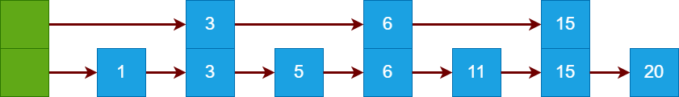
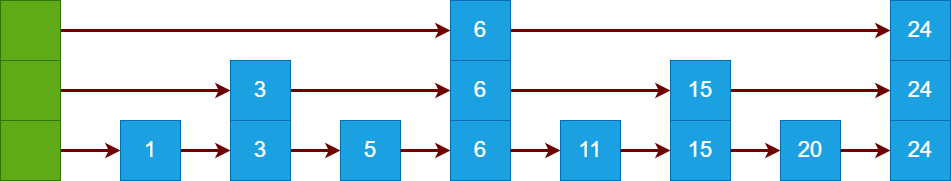
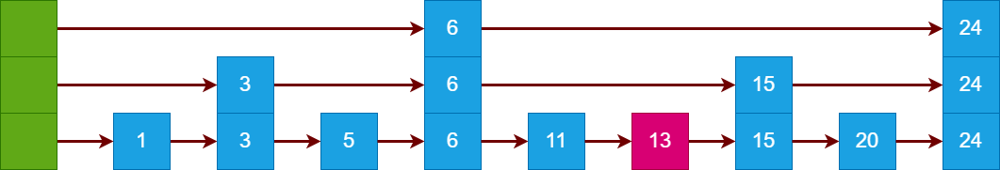
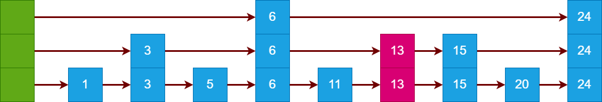
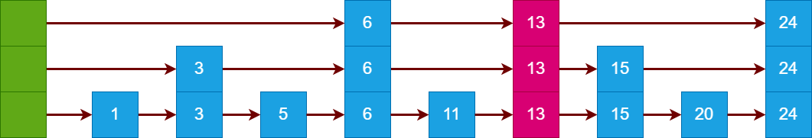
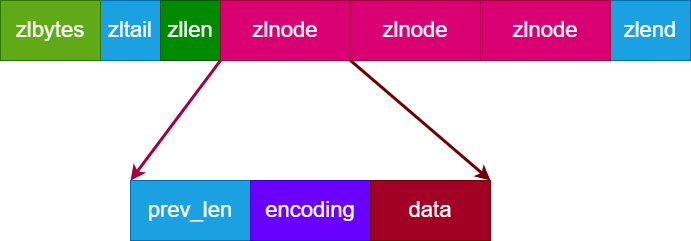
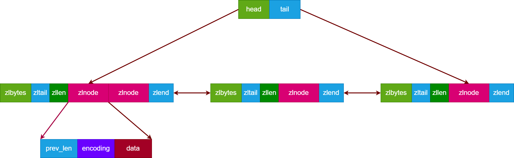

<!--
 * @Author: Gooddbird 1753009868@qq.com
 * @Date: 2023-08-06 13:04:44
 * @LastEditors: Gooddbird 1753009868@qq.com
 * @LastEditTime: 2023-08-27 14:58:59
 * @FilePath: \workspace\treasure\Redis\1.Redis基础数据结构.md
 * @Description: 这是默认设置,请设置`customMade`, 打开koroFileHeader查看配置 进行设置: https://github.com/OBKoro1/koro1FileHeader/wiki/%E9%85%8D%E7%BD%AE
-->
# 1. Redis 数据结构

## 1.1 简单动态字符串 SDS
SDS 即简单动态字符串，字符串就不在多说了，只列举下它的特点：
- SDS 兼容 C 语言的字符串操作函数
- SDS 保存了字符串长度，可以O(1) 获取
- SDS 二进制安全的，可以保存文本或二进制数据

## 1.2 链表 LinkList
Redis 同样支持了链表的数据结构，他是一个无环的双向链表。这里也不再多说。

## 1.3 哈希表 HashTable
HashTable 也是 Dict，即为字典，这是 Redis 的重点数据结构了，也是 Hash 对象或者 Set 对象的底层实现之一。

### 1.3.1 数据结构
我们知道哈希表的特点是O(1)的时间复杂度查找特定元素，但随着元素的增多，Hash 冲突的概率就逐渐增加。Redis 采用开链法来解决 Hash 冲突，即相同哈希值的元素，被存放在一条链表上。单个 HashTable 数据结构如图所示：


如图所示，Hash 值相同的元素，将位于同一条链表上。由于是单向链表，且Redis没保存链表尾节点指针，因此插入新元素时 Redis 采用的是头插法，而不是尾插法。

然而随着元素增多，Hash 冲突严重，链表也会变得过长，查找的效率也会变得低下。为了缓解这种状态，Redis 会进行 rehash 操作。

### 1.3.2 rehash
所谓 rehash, 简单来说就是将一个 HashTable 的元素，重新进行 Hash 后分配到另外一个 HashTable 上，为此，实际上一个 Dict 结构会持有两个 HashTable，就是为了实现 rehash 的。


这两个哈希表 ht[0] 和 ht[1] 同时存在，通常情况下，只有 ht[0] 会实际使用，ht[1]只有在 rehash 时候才会为其分配空间。

由于哈希表的数据可能是非常多的，如果一次性执行完 rehash 操作，就会阻塞整个进程，造成 Redis 无法对外进行响应。因此 Redis 里面 rehash 是一个渐进式操作，而不是一次性完成。rehash 整个过程如下：
  1. 将标志位 rehashindex设为 0, ht[1] 哈希表分配空间，开始 rehash 操作
  2. 执行对字典的增删改查操作时，不仅会操作 ht[0]，会顺便把 ht[0][rehashindex] 索引位所在的键值对 rehash 到 ht[1] 上，完成后 rehashindex++
  3. 最终 rehashindex达到最大值，代表 ht[0] 的元素已经全部 rehash 到 ht[1] 上了，交换 ht[0]和 ht[1]，rehashindex 设为 -1，标志着整个 rehash 过程完成。

可见，渐进式 rehash 并不会一次性操作所有键值对，而是分散逐渐执行，保证了性能和可用性。

rehash 过程中的对键值对的删改查，可能会同时到 ht[0] 和 ht[1] 中进行，不过增加键值对就直接在 ht[1] 上执行了，因为你就算添加到 ht[0] 上，后面还要 rehash 到 ht[1] 上去。

### 1.3.3 rehash 触发条件
rehash 触发无非是：键值对太多，原哈希表冲突率太大了，需要扩容

Redis 使用负载因子来表示哈希表的利用率，负载因子为 键值对总数 / 哈希表大小.

当负载因子 > 1 并且当前没有在执行 AOF 或者 RDB 持久化，就进行 rehash，之所有不在持久化期间执行，是因为持久化会 fork 进程，由于是写时拷贝，如果此时 rehash 就会触发拷贝。

当负载因子 > 5 时，无论是否在进行持久化，都需要进行 rehash,因为此时哈希表已经严重过载了，性能急速下降，需要立即扩容。

## 1.4 跳表 SkipList
说到 Redis 的经典数据结构，跳表肯定是必定被提及的。跳表是从链表衍生而来的。我们都知道，对于链表来说，它的插入、修改节点都是 O(1) 的操作，但如果是查询某个节点，就是 O(n)。 

即使是一个有序链表，我们需要从中找到特定值，也没法像数组一定利用二分法快速查找，因为链表无法随机访问。


由于遍历链表只能一个个节点遍历，这是导致慢的根本原因，如果能几个节点的遍历，速度就快很多了。假设以两个节点为单位遍历，那我们就需要记录这个索引，于是把链表往上增加一层，每两个节点生成一个索引值，如图：



此时，假设我们查找 15 这个元素，遍历过程如下：
1. 首先遍历最上层，第一个元素时3，小于 15,向右
2. 继续3后面的元素，为6，依旧小于15，继续向右
3. 下一个元素正好为15，查找完毕

由此，我们只查找了3个元素，就找到了对应值，相比于直接遍历链表，节省了很多资源。

不过，如果元素增加，那么第二层也会变得很长，这时候遍历第二层也变得很费时了，解决方法就是再往上累加一层：



这就是跳表的形成，通过记录多层索引目录，牺牲空间来换取时间。跳表中每个节点，有个层的概念，比如元素1层级为1，元素3层级为2，元素6层级为3。

现在我们来考虑插入节点，假设向上面链表插入元素 13，应当如何调整上层关系？
最简单的做法当然是不调整，如图所示：



此时我们插入的 13 层级为 1. 不调整当然插入效率最高，但是，思考一下，如果每次插入都不调整的话（即新插入的元素层都为1），那么 6-15 这个范围内就会有很多元素，最终导致这一块范围的查询效率急剧下降。

假设插入的元素 13 层级为 2：


假设插入的元素 13 层级为 3：


可见，实际上新插入的元素不论是多少层都是 ok 的，他对查询效率总是有提升的。

实际上，在 Redis 的跳表中，新增元素的层数是随机的，通过一个随机函数生成。

Redis 跳表的数据结构基本就是这样了，基于跳表的特性，他可以用来存储有序的元素，可以快速的进行有序元素排列的单个查询、范围查询等。

## 1.5 整数集合 IntSet
整数集合是 Redis 为了节约内存设计出的一种数据结构，当一个集合全为整数并且数量不多时，Redis 会采用整数集合来存储。

整数集合的本质思想，就是申请一块连续的空间，有序的存放整数。
我们知道可以用不同字节数代表整数，例如 int64 为8个字节，int32 用4个字节，int16 用两个字节。假设一个集合中整数都是很小的值，用 2 个字节足够存储，那么就没有必要用更多字节数。所以，整数集合有一个 encoding 属性，可以用来指定类型是 int32 还是其他等等。

假如一个整数集合初始 encoding 为 int16， 然后往里面插入一个大数怎么办，此时就需要进行升级。所谓升级，就是申请更多内存空间，然后将原来的 int16 往上扩充为 int32(高位填0即可)。

可见，整数集合本质上就是一个有序数组，它的查找性能是 O(logN)，插入性能是 O(n)。相对于普通数组来说只是尽可能节约内存空间而已。

因此，如前面所说，当一个集合全部为整数并且数量较少的时候，Redis 会采用整数集合来存储，因为数量较少，这时候 O(N) 与 O(logN) 区别也不大，相比较与用跳表等来存储，更能节约空间。

## 1.6 压缩列表 ZipList
压缩列表同样也是为了节省内存而设计的，它同样会申请一块连续的内存空间。



压缩列表由4部分组成：
- zlbytes: 总共占用字节数
- zltail: 到尾部的偏移量
- zllen: 总节点数
- zlnode: 多个压缩列表节点
- zlend: 压缩列表结束符

而每个 zlnode 也由三部分组成：
- prev_len: 前一个zlnode的长度
- encoding: 编码
- data: 存储的数据

重点是这个 prev_len，它代表前一个zlnode的长度，因此，我们可以通过这个值找到前一个 zlnode 的起始位置，从而遍历前一个 zlnode，实现整个压缩链表的从后往前遍历。

prev_len 有个特性：
- 当前一个zlnode 小于 254 字节时，使用一个字节即可。
- 当前一个 zlnode 大于等于 254 字节时，需要使用 5 个字节。

思考这样一个问题，假设原来所有 zlnode都是小于 254字节，因此所有 zlnode 的 prev_len 属性都是1字节。

此时往中间插入一个 zlnode，其长度大于 254 字节。那么其后一个节点就需要扩容其 prev_len，增加4个字节，共使用5个字节来记录 prev_len。

更严重的，此节点扩容后，有可能长度又刚好超过 254 字节，然后又引发后一个节点扩容，一直向后引发连锁反应。这就是压缩链表的连锁更新问题，这会影响插入性能。

归根结底，它的根本原因还是因为记录了前一个节点的长度，因此前一个节点长度变化会影响到后面的节点变化。

## 1.7 QuickList
QuickList 是 Redis 新版本对于 压缩列表 ZipList 的优化，它本质上就是把双向链表和压缩列表结合起来，由多个压缩列表组成一个双向链表，如图所示：



QuickList 通过将元素分散在多个 ZipList 里面，从而减小了连锁更新带来的影响(因为单个 ZipList 的节点变少了，即使发生连锁更新，受影响的节点也相对较少)。


# 2. Redis 基本对象
前面介绍的只是基本的数据结构，而 Redis 具体是怎么使用这些数据结构呢？我们知道，Redis 本质上是一个键值对数据库，比如说：
```
SET str1 "test"
```
实际上是创建了一个键值对，键为str1, 值为 "test"。实际上，这是两个对象，其中 str1 是一个字符串对象，"test" 也是一个字符串对象。

在 Redis 中，键总是 String 对象，而值可能是：String、LIST、HASH、SET、Sorted SET 等之一。

Redis 的对象并不是跟数据结构绑定的，比如 HASH 对象，它的底层数据既有可能是 Dict, 也可能是 ZipList。应当根据当前对象的特点，选择适合的底层数据结构。

使用 `TYPE key` 命令可以获取值对象的类型，使用 `OBJECT ENCODING key` 命令可以查到对应 key 的值对象的编码方式，进而获取到其底层数据结构。

## 2.1 String 对象
String 对象最简单也是最常见的，通过普通的 SET 命令即可创建 SDS 对象：
```
127.0.0.1:6379> set str1 "test"
OK
127.0.0.1:6379> type str1
string
127.0.0.1:6379> OBJECT ENCODING str1
"embstr"
127.0.0.1:6379>
```

String 对象的应用场景非常广泛，就不单独举例了。

## 2.2 LIST 对象
LIST 对象通常用来存放一些无序的，类型不一致的集合，LPUSH 命令可以创建一个 LIST 对象：
```
127.0.0.1:6379> LPUSH list_test 1 2 "name" "hello" 6
(integer) 5
127.0.0.1:6379> LRANGE list_test 0 -1
1) "6"
2) "hello"
3) "name"
4) "2"
5) "1"
127.0.0.1:6379> TYPE list_test
list
127.0.0.1:6379> OBJECT ENCODING list_test
"quicklist"
127.0.0.1:6379> 
```
这里可以看到 Redis 采用了 QuickList 来存储 LIST 对象，当然在旧版本中仍然可能采用 LinkList 或者 ZipList 来作为 LIST 对象的底层数据结构。

基于 LIST 对象的特性，通常可以用来做简单的消息队列。生产者消费者分别使用 LPUSH 和 RPOP 往队列里面生产或者消费消息对象，这就是简单的消息队列模型。

尽管 LIST 可以作为消息队列，能保证消息的有序性，但无法保证消息可靠、不丢失。所以一般情况下还是尽量选择专业可靠的消息中间件如 Kafka 等。


## 2.3 HASH 对象
HASH对象也是常见的对象类型，它的底层数据结构可能是 ZipList 压缩列表，或者 HashTable。
```
127.0.0.1:6379> HSET hash-test key1 1
(integer) 1
127.0.0.1:6379> HSET hash-test key2 'test'
(integer) 1
127.0.0.1:6379> HGETALL hash-test
1) "key1"
2) "1"
3) "key2"
4) "test"
127.0.0.1:6379> TYPE hash-test
hash
127.0.0.1:6379> OBJECT ENCODING hash-test
"ziplist"
127.0.0.1:6379> 
```
同样的，HASH 对象底层也是无序的。

HASH 对象可以为我们存储一些键值对元素:
- 将 MySQL 的单行信息以 field: value 的形式存储
- 存储配置信息，作为配置中心。

## 2.4 SET 对象
SET 意为集合，它的特点是无序、去重。SET 的底层实现可能是 IntSet 或者 HashTable：
- 当集合中全为整数并且小于 512（默认配置）时，使用 IntSet
- 其余情况使用 HashTable

使用 SADD  命令可以创建或修改一个 Set，例如一个整数集合：
```
127.0.0.1:6379> SADD set-test 1 2 4 11
(integer) 4
127.0.0.1:6379> SMEMBERS set-test
1) "1"
2) "2"
3) "4"
4) "11"
127.0.0.1:6379> TYPE set-test
set
127.0.0.1:6379> OBJECT  ENCODING set-test
"intset"
127.0.0.1:6379> 
```
再创建一个元素为字符串的 set，其底层数据机构是 HashTable
```
127.0.0.1:6379> SADD str-set-test iker alice bob
(integer) 3
127.0.0.1:6379> SMEMBERS str-set-test
1) "alice"
2) "iker"
3) "bob"
127.0.0.1:6379> TYPE str-set-test
set
127.0.0.1:6379> OBJECT ENCODING str-set-test
"hashtable"
127.0.0.1:6379> 
```
Redis 也支持多个 Set 的交集、并集、差集等计算，应用场景有：
- 共同好友推荐：通过两者集合的运算
- 抽奖场景

这里说一下抽奖场景，SET 非常适合用来抽奖，只需要将所有参与者的 ID 添加进 SET 即可， SET 提供 SPOP 命令，可以随机从 SET 里面返回成员，从而实现抽奖。

## 2.5 ZSET 对象
ZSET 则是有序的集合，相比较与普通的 Set 而言，他多了有序的这个特点。ZSET 将集合中的每个元素拆分为两部分（member + score），ZSET 按照元素的 score 升序排序。

ZSET 的底层数据结构有两种情况：
- 元素较少的情况下使用 ZipList
- 否则使用 SkipList，并且辅以一个 Dict 字典

当使用 ZipList 的时候，直接按照 score 大小在 ZipList 中升序排列即可，此时若插入新元素，会涉及到调整 ZipList，移动插入位置后的内容。因此，只会在元素较少的情况下使用 ZipList.

元素较多的时候，Redis 会选择使用 SkipList 来实现 ZSET 对象，这也是 SkipList 在 Redis 里面为数不多的使用场景了。

前面我们分析过，SkipList 的特点是有序、查找效率高、适合范围查询等.

除了使用 SkipList 之外，Redis 还使用一个字典 Dict 来存储每个元素，其中key为 merber，value 为 score。这样的目的是为了能 O(1) 查询某个元素的 score 是多少，而不用再去遍历 SkipList 定位元素。其实就是牺牲空间换取时间了。

ZADD 命令可以创建或修改一个有序集合：
```
127.0.0.1:6379> ZADD zset-test1 2 a 11 b 3 c 6 d
(integer) 4
127.0.0.1:6379> ZRANGE zset-test1 0 -1 WITHSCORES
1) "a"
2) "2"
3) "c"
4) "3"
5) "d"
6) "6"
7) "b"
8) "11"
127.0.0.1:6379> TYPE zset-test1
zset
127.0.0.1:6379> OBJECT ENCODING zset-test1
"ziplist"
127.0.0.1:6379> 
```

ZSET 的应用场景很多，其中经典的当属实现排行榜功能了，例如微信步数排行、游戏的战力排行榜等，使用 ZSET 可以很方便实现。


