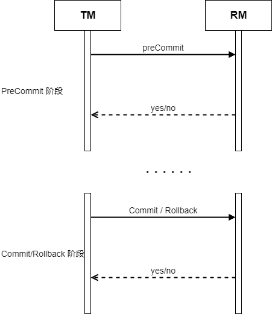

# 1. 从单机事务到分布式事务
说分布式事务之前，先提一下单机事务。**事务**是作后端开发人员几乎必须掌握的一个点，当然这里说的是狭义上的数据库的事务。

在 MySQL 章节中，介绍过单机事务。单机事务具有 ACID 特性:
- Atomicity(原子性)：原子性代表事务中的操作，要么全部执行成功，要么全部都不执行。
- Consistency(一致性): 指数据库必须从一个正确的状态迁移到另一个正确的状态。
- Isolation(隔离性): 并发执行多个事务时，各个事务之间互不干扰。
- Durability(持久性): 事务执行完后，数据不会丢失。

随着微服务、分布式等技术的兴起，一个系统被拆分成立多个微服务，他们共同组成了分布式系统架构。在分布式系统下，单机事务已经无法足以满足我们的需求了。

例如支付系统常见的转账服务，最开始他只有一个转账服务。所有资源公用一个 DB：


现场景为用户 A 转账给用户 B 100元，在这个过程中，我们要做三件事：
```
1. 账户生成一笔转账单，状态 State 为初始态。并且锁定这笔单，防止并发导致数据异常。
2. A 账户扣除 100 元
3. B 账户增加 100 元
4. 转账成功，转账单状态 State 置为成功，解锁转账单。
```

如果是单机事务，可以很容易完成上面的操作，直接使用 MySQL 开启一个事务即可。

然而事实很残酷，由于用户量大、单机性能受限、DB受限等原因，对以上架构做了拆分。首先账户资源的 DB 跟转账单据的 DB 做了拆分，同时账户的 DB 也拆分为多个数据库实例。


此时转账需要完成这些操作：
```
1. 转账服务生成一笔转账单，状态 State 为初始态。并且锁定这笔单，防止并发导致数据异常。
2. 转账服务调用账户服务，请求 A 账户扣除 100 元
3. 转账服务调用账户服务，请求 B 账户增加 100 元
4. 转账成功，转账服务将转账单状态 State 置为成功，解锁转账单。
```

由于 DB、服务之间都做了拆分，此时的事务横跨了多个服务，多个DB资源，原本能直接在当前DB执行的操作，现在变成了调用其他服务的接口来实现，这就是分布式事务。

而假设上面场景中，A账户扣除余额失败怎么办？A账户扣除余额成功，但是B账户增加余额失败怎么办？分布式事务同样满足原子性、一致性。

可见，分布式事务的实现，就没法像单机事务那么简单了。显然，你没法保证每个子事务都能执行成功，为此需要设计一些补偿、逆向等流程来确保分布式事务正常执行。

下面将简单介绍一些分布式事务的解决方案

# 2. 强一致性方案
一致性是分布式系统的一个经典问题，更多细节可以阅读之前的分布式基本理论章节：


## 2.1 2PC
2PC 是非常经典的分布式事务解法方案之一，虽然现实生产环境中基本不用到单纯的2PC，但了解它的思想是很重要的，其他的解决方案多多少少跟2PC也有很大的相关性。

### 2.1.1 XA 协议
在说 2PC 之前，先介绍一个概念。XA 协议是由 X/Open 组织提出的一种分布式事务处理规范，也叫 DTP（Distributed Transaction Processing）模型，他把分布式事务的参与者划分为：
- AP：AP即应用程序，即需要操作资源的业务方，例如上例中的转账服务，他就是一个 AP。
- RM：RM即资源管理器，例如上例中的 DB 就属于RM。
- TM：TM即事务管理器，它是整个完成分布式事务的核心，用来协调整个分布式事务。

而XA协议则是规定了 TM 与 RM 的通信规范，像 MySQL 等数据库就支持XA协议，可以利用它来横跨多个 MySQL 实例实现分布式事务，但实际生产一般不会这样用，主要也是因为它使用的 2PC 性能太差了。

### 2.1.2 2PC 概述
XA协议使用 2PC 完成分布式事务，2PC （二阶段提交），它整个通信过程如下：




可以看到，2PC分为两个阶段:
第一个阶段为 preCommit 阶段，由TM向各个 RM 发送 preCommit RPC 请求，询问其是否能进行提交操作。RM在收到请求之后，记录对应的日志（例如MySQL需要记录 undo log, redo log），锁定需要的资源等等，总而言之就是把能做的事情都做了，最大程度保证提交的成功率，然后对TM返回 yes。
当然，如果某个 RM发现其无法就绪，例如资源不足等原因，认为自己后面大概率无法提交成功，此时分布式事务做失败即可，即对TM返回 no。


第二个阶段为 Commit/Rollback 阶段，TM 根据 **所有 RM** 的回应来做决策。

若所有 RM 在 preCommit 阶段都返回了 yes，此时 TM 认为可以分布式事务可以提交，向每个 RM 发送 Commit 的 RPC 请求，每个 RM 收到请求后，执行本地事务的真正提交，然后向 TM 返回 yes。

若某个 RM 在 preCommit 阶段返回了 no，则认为分布式事务无法执行成功，此时进入 Rollback 流程，TM 向各个 RM 发送 Rollback 的 RPC 请求，请求各个 RM 回滚其事务，恢复执行前的状态，当所有 RM 回滚成功后，整个分布式事务失败。

然而实时可能存在很多异常情况，例如：
preCommit 阶段时，每个 RM 收到请求后会立刻锁资源，直到整个分布式事务执行完后才会释放资源。

Commit 阶段时，若某些 RM 提交事务失败了，没有向 TM 返回 yes，为了确保分布式事务正常提交，此时 TM 需要不断重试。

Rollback 也是一样，若第二阶段是回滚命令，必须确保每个 RM 都能成功执行 Rollback，否则其会一直持有资源不释放，因此失败也必须一直重试。

TM 是个单点，一旦TM宕机，整个分布式事务都无法执行了，并且所有的 RM 都会一直持有资源不释放，造成严重的阻塞。

## 2.2 3PC
3PC 是为了解决 2PC 的一些问题而提出的优化，但说是优化，却仍然遗留了一些问题，相比之下3轮 RPC 通信也导致性能大幅下降，所以生产也基本不会使用，这里不再提及了。


# 3. 弱一致性方案
大多数情况下，并不会一定要求强一致性。我们可以接收一定的数据延迟、降级等策略，牺牲一部分一致性，而增加可用性。这就是 BASE 理论的由来，BASE 理论强调的是最终一致性，它允许分布式系统暂时处于中间的软状态，此时数据不满足一致性，但经过一定时间内，最终会趋于一致。

## 3.1 TCC
TCC(Try, Commit, Cancel) 是一种基于弱一致性的分布式事务解决方案，事实上他跟 XA的 2PC 看起来很像，不过 XA 是一般基于资源管理器，而 TCC 更多是基于业务层面。

TCC 同样需要一个事务管理器 TM 来协调分布式事务，它的整体交互如下：


### 3.1.1 Try 阶段
在 Try 阶段，每个服务收到 Try 请求后，需要锁定当前事务需要的资源，例如冻结余额、冻结库存等操作，总之就是把当前事务需要的资源先行预留下来，提升后续提交事务的成功率。如果资源预留成功，服务向 TM 返回 yes。反之返回 no，代表资源不足，无法预留。

### 3.1.2 Commit 阶段
TM 收到所有服务的回应后，若所有服务均返回 yes，那么 TM 决策分布式事务可以提交，于是进入 Commit 阶段，向所有服务发送 Commit 命令，服务收到 Commit 后开始执行本地的提交逻辑，例如真实的扣减库存、扣减余额等操作。

由于之前 Try 阶段已经预留资源了，所以这里提交的时候成功率是比较高的。当然，如果某个服务提交失败，则 TM 会一直重试，直到其成功为止。当所有服务提交成功后，整个分布式事务执行成功。

### 3.1.3 Cancel 流程
若 Try 阶段后 TM 收到某个服务返回了 no,此时 TM 决策分布式事务无法成功执行，于是进入 Cancel 阶段，向每个服务发送 Cancel 命令，恢复其预留的资源，如解冻库存、解冻余额等操作。

### 3.1.4 TCC 实例
TCC 的特性天然适合于向支付系统、电商平台这些场景。就以前面的转账为例。
```
1. A 账户扣除 100 元
2. B 账户增加 100 元
```

TCC 同样需要一个事务管理器 TM 的角色，用于协调各个服务参与者。

首先，TM 分析AB账户的资金情况，得到两个子事务。
- 子事务1：A账户-100
- 子事务2：B账户+100

我们知道，增加余额是一定能执行成功的，大不了重试几次，而扣减余额则不一定，可能因为余额不足导致永远无法执行成功。因此，对于子事务1，需要冻结其100元资金，以便后面能成功扣款；而子事务2可以不用冻结。

分析完毕后，记下来 TM 调用各个账户服务的 Try 接口，子事务1发送给服务1，子事务2发送给服务2：

注：服务1和服务2有可能都是同一个模块，甚至同一个实例，本质上他们都是一个操作资金账户的服务，这里区分服务1和2主要是说明他们一个执行的是子事务1，另一个执行的是子事务2.

Try 阶段：
对于子事务1，在 Try 接口会请求冻结100元，而对于子事务2，暂时什么都不做。然后等待返回结果。服务1收到请求后，成功冻结A账户100元，返回ok。服务2返回ok。

Commit 阶段：
TM 收到两个服务的ok之后，进入 Commit 阶段。调用各个服务的 Commit 接口进行真实的余额操作。
服务1收到请求后，将 A 账户之前冻结的余额进行扣减，B服务2收到请求后，将 账户增加 100 元。

Cancel 阶段：
Try时，若服务1发现A账户余额小于100，无法冻结。因此服务1在 Try 阶段返回 no，TM 收到这个回复后，决策分布式事务无法执行，进入 Cancel 阶段，向各个服务发送 Cancel 请求，对于服务1，Cancle 请求是解冻100块（当然有可能之前就没冻结成功，这里只是简单起见，实际业务处理比这复杂的多）。所有服务 Cancel 成功后，整个分布式事务执行失败，就跟没发生一样。


注：此处只是一个很简单的示例，实际的支付系统中，还会额外记录账户流水、单据等信息。同时引入对账等机制，确保资金的一致性。

### 3.1.5 TCC 特点
TCC 虽然看上去跟 2PC 很像，但是细看还是有很多不同：
- TCC 只会在 Try 阶段预留必要的资源时候加锁，不会像 2PC 整个分布式事务期间都锁定资源，因此 TCC 的性能要高很多。也就是说，假设多个分布式事务并行，TCC 下他们只会在 Try 阶段阻塞，一旦进入了 Commit 后，事务间就不存在阻塞等待了。而 2PC 的话整个分布式事务期间都会阻塞等待。
- TCC 基于业务层面，而 XA 的 2PC 协议是基于资源管理器的，一般就是数据库，例如 MySQL 等
- TCC 业务侵入性较强，业务需要分别实现 T C C 三个接口
- TCC 过程中有重试机制，因此服务接口需要支持幂等
- TCC 有可能发生空 Cancel，即没有收到T请求，直接收到Cancel请求，需要考虑这种情况。

### 3.1.6 如何理解TCC的弱一致性和2PC的强一致性?
即便看到这，很多人还是不理解 TCC 和 2PC 的区别，为什么一个是弱一致性，一个是强一致性？明明这两个看上去这么像。

个人使用这种方式来理解一致性，当然不一定正确。这里还是借助转账这个例子来理解一致性：
```
1. 子事务1：A 账户 -100
2. 子事务2：B 账户 +100
```
一致性，当然是指的数据的一致性。具体到这个例子上，就是资金的平衡。资金不会凭空出现，也不会凭空消失。
当能看到 A-100 的时候，那么同时必须看到另外一个账户 B +100. 即同时看到这两个资金的一起发生变动，则说明数据是一致的。

如果某时刻，我们看到 A-100，但是此时B账户没有增加100，此时资金就凭空消失了，那么这个时间的数据就是不一致的。反映到事务上，就是我们已经能观测到子事务1执行成功了，子事务2执行失败或者还没来得及执行。

之所以说 2PC 是强一致性，是因为它在整个分布式事务期间锁定了相关的资源，从对外观测者的角度来看，他要么只能看到子事务1和2同时执行成功，要么只能看到两个事务同时执行失败。因此说2PC是强一致性的。

而对于 TCC 来说，它在 Try 阶段只锁定必要的这部分资金，这个锁定的结果是可以被观测到的，即被其他事务可见。即此时我们如果来查询，会观测到 A 账户已经-100（这100被冻结了），但是B账户还没+100。这个时刻数据是不一致的。

为什么我们通常会选择 TCC 而不是 2PC呢，虽然 TCC 是弱一致性，但在某些场景下，这种弱一致性是可以接收的，对用户来说，他发起了转账后看到自己的资金马上被扣减了，但对方账户还没收到钱，只要在一定时间范围呢，都是可以接受的。而真正对于强一致性要求的场景反而不多。


## 3.2 本地消息表
本地消息也是一种分布式事务解决方案，它的思想是把分布式事务转为本地事务，通过记录一条消息，然后由另外一个进程去异步消费这条消息，不断重试执行下一个事务。

举个例子：
```
1.  A 账户扣除 100 元
2.  B 账户增加 100 元
```
在转账服务中，做了第一步之后，之后需要调用下游服务扣减 A 账户余额。为了保证事务的原子性，转账服务不仅扣减了A账户余额，同时也向数据库生成一条本地消息 msg，插入到消息表，msg 的内容是（增加B账户100）. 
这两步都在一个本地事务中执行，例如依靠 MySQL 的事务特性，因此能保证，只要扣了A账户的资金，一定能生成一条 msg。

然后再用一个单独的进程，不断循环读取该消息表，然后执行其内容。

整个过程如下图：


可见，本地消息表也是一种弱一致性方案，它的原理是将分布式事务转换为本地事务，然后依靠的异步定时服务去做补偿流程，达到最终一致性。

## 3.3 事务消息队列
说到消息，自然会想到消息队列。本地事务消息表是将消息放在本地数据库中，那当然我们也可以把消息放到消息队列 MQ 里面。

但这里有一个难点，原来本地消息表里面：
```
1. 执行业务 SQL
2. 插入本地消息表
```
这两步可以用 MySQL 的单机事务保证，但是如果用消息队列的话：
```
1. 执行业务 SQL
2. 发送消息给 MQ
```
这两步没法用单机事务来保证。
假设：我们先执行本地事务，再发送给MQ，如果执行完本地事务后进程崩溃了或者发送消息给MQ失败了，MQ没收到消息，那么后面的事务永远都不会执行了。

同样的，假设我们先发送消息给MQ，然后再执行本地事务，假如执行本地事务失败了，但消息已经给到MQ了，消费者此时可能已经成功消费了此消息，执行了事务。

因此无论怎么调整顺序都有问题，还需要引入额外的手段。例如 RocketMQ 支持事务消息，它的做法是通过消息反查来保证消息成功提交。引入 RocketMQ，执行顺序如下：
```
1. 向 RocketMQ 发送半消息，注意，此时的消息虽然发送过去了，但不会被消费者感知，此消息还未被提交，他会被放到一个特殊主题里暂存。
2. 执行业务 SQL, 即本地事务
3. 向 RocketMQ 发送 Commit，提交消息。
```
注意，第3步可能会失败，会导致之前发送的消息一支部提交。因此 RocketMQ 提供了消息反查机制，MQ 会主动去查询还没 Commit 的消息，询问其是否能提交。

整个过程如下图:


基于 MQ 的事务消息，原理跟本地消息表差不多，只是引入了中间件来处理消息。为了防止消息提交失败，额外引入了消息反查机制。同样他也是一种弱一致性方案。


